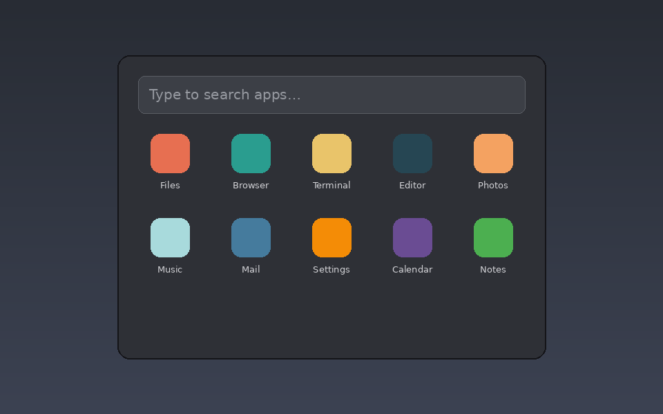

# Cinnabon App Launcher

A centered, search-first application launcher for Cinnamon — press `Super+Space`
and start typing.

## Features

- Fuzzy search across installed applications, with matched letters highlighted.
- Frequently/recently used apps surfaced first when the launcher opens empty.
- Inline calculator — type a sum like `12*(3+4)` and press Enter to copy the result.
- Quick system actions (Lock Screen, Log Out, Shut Down, Open Settings) reachable
  from the same search box.
- Sized to stay correct on HiDPI displays, and clamped to fit small/secondary
  monitors.
- Keyboard-first: arrow keys to move, Enter to activate, Escape to dismiss.
